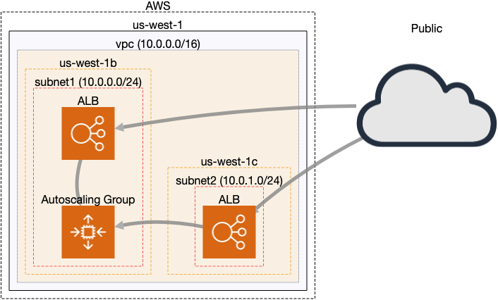

# Terraform
This repo uses Terraform to deploy an infrastructure to AWS with the following resources:

- An ECS cluster with related service and task definitions containing a [Hello World container](https://github.com/markgllin/docker-python-flask-helloworld)
- An autoscaling group with a CloudWatch alert attached that triggers/scales based on cpu usage (see [Problems](https://github.com/markgllin/terraform-practice#problems) below)
- CloudWatch alarm that alerts via email
- A loadbalancer with a self-signed cert attached. Webpage is served over HTTPs.
- (Limited) configurability, i.e. environment specific clusters

The network diagram looks like this:



# Usage
## Requirements
The following are needed to start:
- An AWS account
- Terraform v0.14.10
- A Terraform Cloud account (Optional)
- GitHub Actions enabled (Optional)

## Deploy

### Terraform Cloud via GitHub Actions
To deploy this same infrastructure to AWS via Terraform Cloud, do the following:

1. clone the repo locally
2. update `main.tf` accordingly with your own remote backend configuration. 
    1. Create a new workspace in Terraform Cloud account and add `AWS_ACCESS_KEY_ID` and `AWS_SECRET_ACCESS_KEY` as sensitive environment variables to the workspace. This allows TF to authenticate against AWS.
    2. Create an API token in Terraform Cloud and add it to the GitHub repo as a secret (`TF_API_TOKEN`). This allows GH to authenticate against TF Cloud to kick off tf commands.
3. push to a branch

### From local
To deploy infrastructure from local:
1. clone the repo locally
2. remove remote backend configuration from `main.tf`. 
3. `terraform init`
4. optionally, a `terraform plan` to view resources to be created
5. `terraform apply`

To change default values of configurable variables, pass in the desired value like so:

```
# creates ecs cluster in staging environment
terraform apply -var 'environment=staging'

# creates ecs cluster in qa environment
 terraform apply -var 'environment=qa'
```

### Output
In both cases, the output will be similar to the following:
```
...
...
aws_appautoscaling_target.ecs_svc_target: Destroying... [id=service/ecs-cluster-qa/ecs-cluster-helloworld-svc]
aws_appautoscaling_target.ecs_svc_target: Destruction complete after 0s

Apply complete! Resources: 32 added, 0 changed, 0 destroyed.

Outputs:

instance_ip_addr = "ecs-cluster-qa-lb-914436477.us-west-1.elb.amazonaws.com"
```

`instance_ip_addr` corresponds to the A record of the application loadbalancer. To view the webserver, paste the value into a browser. Be sure to add `https://` as there is no automatic redirection. If using the default container, the page can also be refreshed and the server name should be updated each time to indicate loadbalancing is working.

# CI/CD
Currently, GitHub Actions is being used in conjunction with Terraform Cloud to deploy the infrastructure on merge to `main`. The workflow is as follows:
1. A pull request is made to the repo
2. GH Actions kicks off a job to validate the formatting and generate a plan
3. On merge, a `terraform apply` is performed through Terraform Cloud and the infrastructure is updated

This workflow is largely identical to HashiCorp's GitHub Actions [example](https://learn.hashicorp.com/tutorials/terraform/github-actions).

# Problems:
- many parameters were 'hardcoded' due to time constraints. I plan to address this later on by setting some values as variables as I have done with some of them in `variables.tf`
- this repo could be turned into a Terraform module to allow for greater reusability. I envision a module that accepts an `environment` parameter and all required resources would be automatically created.
- use a real cert instead of a self-signed cert
- something I forgot to add — while autoscaling of EC2 instances is implemented, I didn't add autoscaling for the actual ECS service itself. As such, the CloudWatch alarm will trigger an increase of EC2 instances but that won't actually impact the cluster as new ECS services won't be added to occupy those EC2 instances 🤦 

# Future:
Aside from addressing the above issues, additional things I plan to do:
- add more robust monitoring and enabling/adding something like Datadog or Container Insights for better metrics on individual container performance
- pull access logs and container logs and ship them to Elastic Stack so that they can be reviewed, searchable, and aid in debugging issues
- add more alerts to notify on issues like abnormal resource usage, spikes in traffic or HTTP 5XX errors to meet SLOs
- switch to Fargate to minimize overhead with maintaining EC2 instances
- add infrastructure tests with [Terratest](https://terratest.gruntwork.io/)

# Resources
- [Terraform docs](https://www.terraform.io/docs/)
- [AWSs docs](https://docs.aws.amazon.com/)
- [GitHub Actions docs](https://docs.github.com/en/actions)
- [HashiCorp tutorial on GitHub Actions with Terraform Cloud](https://learn.hashicorp.com/tutorials/terraform/github-actions)
